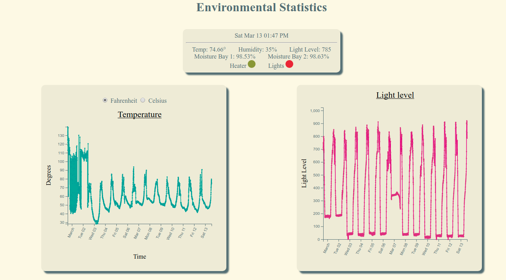

# PiGro

This project utilizes an Arduino Uno paired with a Raspberry Pi 3b+ (though any Raspberry Pi would work), to automate a small greenhouse and host a local website which allows you to view visualizations of the greenhouse statistics. Things like temperature, humidity levels and etc...

# Capabilities

Currently the project tracks temperature, humidity, light leves, and soil moisture levels. It will water a plant bay when soil moisture drops below a set threshold. It turns on a strip of LED grow lights when the light level drops, and operates a small heater to prevent freezing when the temperature drops below a set threshold.

# Major TODO's

- [x] Get Pi communicating thresholds back to arduino.
- [ ] Move from static graphs to interactive graphs.
- [x] Get the graphs to update as new data comes in.
- [ ] Set arduino to request threshold data from
      the raspberry pi on first startup.
- [ ] Add a way for comunicaiton.py to continue gracefully
      if arduino device file isn't found, at least fail
      gracefully and leave a log about what went wrong.

# Sample Web UI



# Installing

Things needed to use this

- Raspberry Pi 3b+ (or higher)
- Arduino Uno
- DHT11 sensor
- Water valve solenoids
- Soil Moisture Sensors
- Photovoltic transistor
- Misc resistors, kickback diodes.
    - More details to come.

## Raspberry Pi Setup.

- Use Raspberry Pi Imager to install [Raspian Lite](https://projects.raspberrypi.org/en/projects/imager-install)
- Ensure Raspian is up to date.
    ```sh
    sudo apt update && sudo apt upgrade -y
    ```
- Install [Arduino CLI](https://arduino.github.io/arduino-cli/0.19/)
    -  Run the command below to download and install arduino-cli
    ```sh
    curl -fsSL https://raw.githubusercontent.com/arduino/arduino-cli/master/install.sh | BINDIR=~/.local/bin sh
    ```
    - Download required board files, and the libraries "dht" and "cheapstepper"
    ```sh
    arduino-cli core update-index
    arduino-cli core install arduino:avr
    arduino-cli lib install "DHT sensor library"
    arduino-cli lib install "CheapStepper"
    ```
- clone this repo
```sh
git clone https://github.com/jerome1232/PiGro.git
```
- Install apache2
```sh
sudo apt install apache2
```

- Configure apache with the apache configuration script
```sh
# Note you may need to edit apache2_config/pigro.conf
# and apache2_config/pigro-cgi-bin.conf respectively.
# especiallly if you are not using the default pi
# user, you will also need to adjust the config_apache.sh script
sudo ~/PiGro/apache2_config/config_apache.sh
```

Inside the arduino_src directory there are 3 helper scripts that assist with compiling and uploading the Arduino code. compile.sh, upload.sh, and compile_uplad.sh. Their use is simple, run the script and they will do their namesake.

- Demonstrate arduino compile helper scripts

To compile, simply cd into the arduino_src folder, and run the compile script. Give the Arduino envirnment is properly setup, it should compile the arduino code.

```sh
cd ~/PiGro/arduino_src
./compile.sh
```

- Demonstrate arduino upload helper script

When you are ready to upload the compiled code to the arduino simply call the upload script. *Note*: The upload script will restart the arduino.

```sh
cd ~/PiGro/arduino_src
./upload.sh
```

Both can be done in one fell swoop by calling the compile_upload.sh script.

```sh
cd ~/PiGro/arduino_src
./compile_upload.sh
```

*note*: You don't actually need to cd into arduino_src, you can run the script from anywhere with the full or relative path.

- Daemonize communication.py [Setup pigro.service](python_src/README.md)
